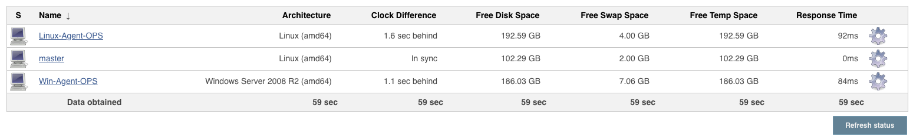
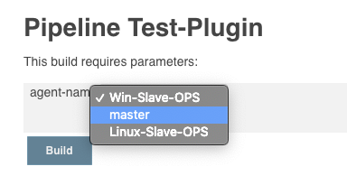
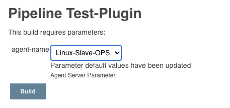

# Agent Server Parameter Plugin

这个插件用于在构建之前选择构建服务器，如果你有多台构建服务器，那么你可以用这个插件在构建之前方便的进行选择，插件会记住每次选择的服务器方便下次构建时使用。

使用这个插件的优势在于你可能有多台用于构建的服务器：


## 基本配置

在项目的配置页面选择"This project is parameterized"复选框，添加"Agent Server Parameter"参数，创建参数名称,还可以点击"高级"设置默认的构建服务器名称，默认值不是必填选项，如果为空则默认master服务器。


在构建时读取参数值的方法：

```groovy
node{
    print params['agent-name']
}
```

## 构建之前选择服务器



每次选择服务器之后都会更新默认值，方便下次构建使用。



## Declarative Pipeline

```groovy
pipeline {
   agent { label params['agent-name'] } 

   parameters{
      agentParameter name:'agent-name'
   }
   stages {
      stage('Hello') {
         steps {
            print params['agent-name'] 
         }
      }
   }
}
```

可以在构建脚本中创建参数，但因为每次执行构建脚本都会创建一个新的"Agent Server Parameter"构建参数，所以无法保留上次选择的值。
